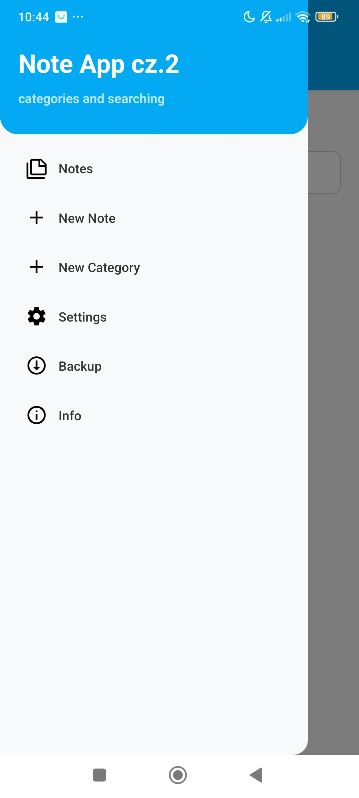
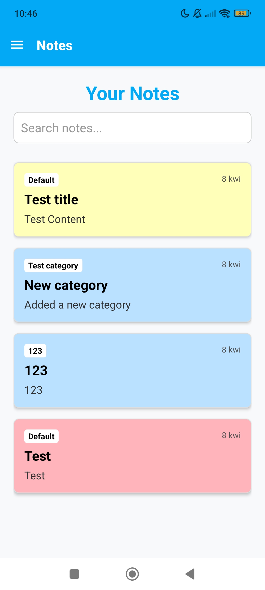
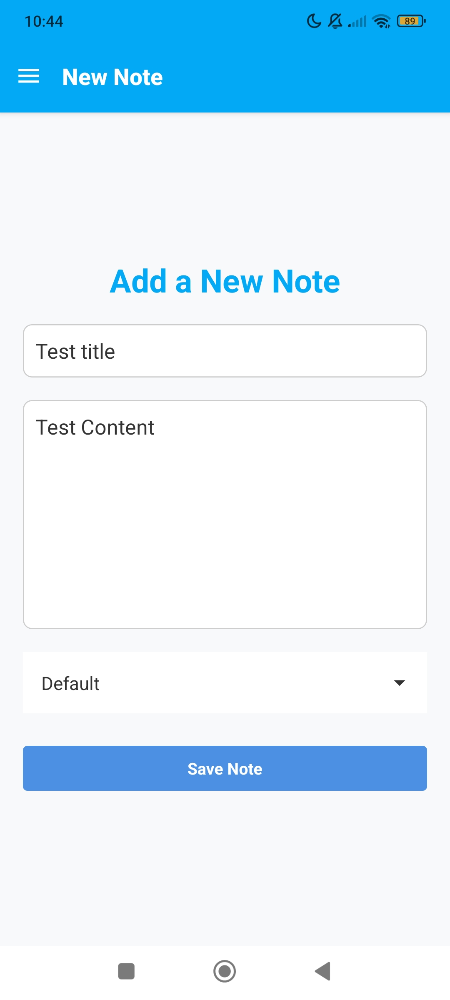
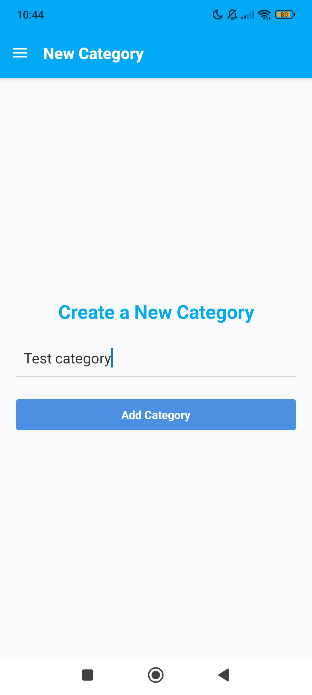
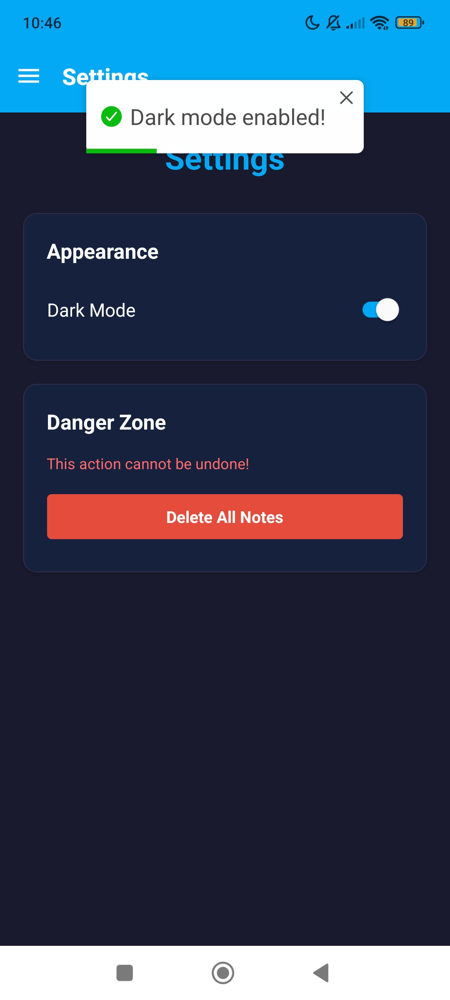
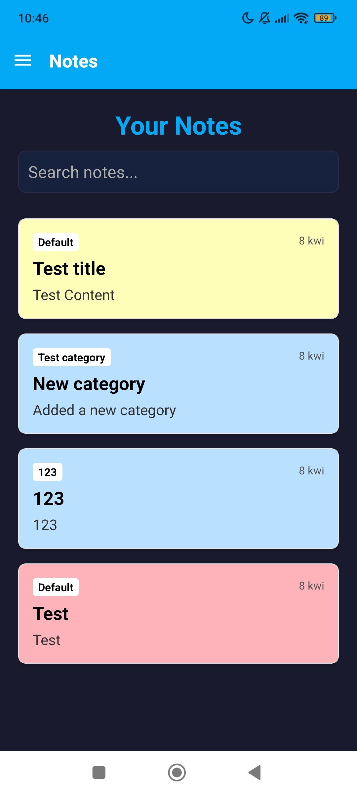
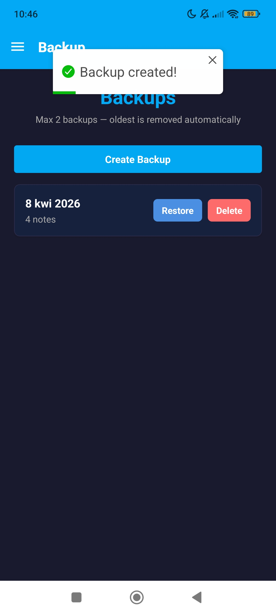
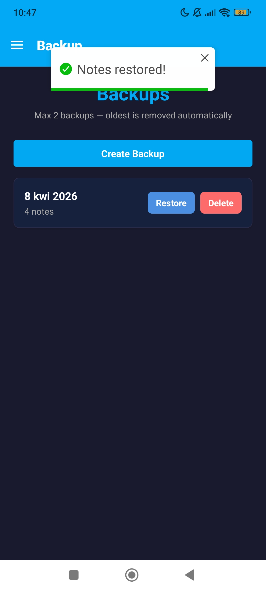

# 📝 Note App

A React Native mobile application built with Expo paired with a Node.js + MongoDB server. Create and organize notes with categories, search through them, switch between light and dark mode, and back up your data to a local server.

---

## ⚠️ Compatibility
Built with **Expo SDK 52**. 
Expo Go currently (April 2026) supports **SDK 55** — run via development build or downgrade.

---

## Screenshots

<p align="center">
  
  
  
  
</p>
<p align="center">
  
  
  
  
</p>

---

## Features

- 📝 **Create notes** — add a title, content and category to each note
- ✏️ **Edit notes** — tap a note to update its content
- 🗑️ **Delete notes** — long-press a note to remove it
- 🏷️ **Categories** — create custom categories and assign them to notes
- 🔍 **Search** — filter notes by title, content, category or date
- 🎨 **Note colors** — each note gets a random pastel background color
- 🌙 **Dark mode** — toggle between light and dark theme, persisted locally
- 💾 **Backup & Restore** — send notes to a local Node.js server backed by MongoDB
- 🔄 **Auto-cleanup** — maximum 2 backups stored; oldest is removed automatically

---

## Getting Started

### Prerequisites

- [Node.js](https://nodejs.org/) (v18 or later)
- [Expo Go](https://expo.dev/client) app on your Android device, or an Android emulator
- [MongoDB](https://www.mongodb.com/) instance (local or Atlas)
- Both your computer and phone must be on the **same local network** (for backups)

### Installation

```bash
git clone https://github.com/Avareez/Note-App.git
cd Note-App
```

```bash
# Server
cd NoteServer
npm install
```

```bash
# Client
cd ../NoteApp
npm install
```

### Configuration

Before running the app, update the server IP address in the Backup screen to match your machine's local IP:

```javascript
// NoteApp/screens/Backup.jsx
const SERVER_URL = 'http://YOUR_LOCAL_IP:3000';
```

You can find your local IP by running `ipconfig` (Windows) or `ifconfig` (Mac/Linux).

Create a `.env` file in `NoteServer/` based on `.env.example`:

```env
MONGO_URI=mongodb://127.0.0.1:27017
DB_NAME=notes_backup_db
PORT=3000
```

### Running

Open two terminals and run both at the same time.

**Terminal 1 — Server:**
```bash
cd NoteServer
node index.js
```
Server runs at `http://localhost:3000`

**Terminal 2 — Client:**
```bash
cd NoteApp
npx expo start
```

Scan the QR code with **Expo Go** on your Android device, or press `a` to open in an Android emulator.

> ⚠️ The app is designed and tested on **Android only**.

---

## API Endpoints

| Method | Endpoint | Description |
|---|---|---|
| `GET` | `/api/backup` | Get all backups |
| `POST` | `/api/backup` | Create a new backup |
| `DELETE` | `/api/backup/:id` | Delete a backup by ID |

> ⚠️ Maximum of **2 backups** are stored — creating a new one automatically removes the oldest.

---

## Project Structure

```
Note-App/
├── NoteApp/
│   ├── assets/
│   ├── components/
│   │   ├── MyButton.jsx        # Reusable button component
│   │   └── NoteItem.jsx        # Note card with tap and long-press actions
│   ├── context/
│   │   └── ThemeContext.js     # Dark/light theme provider
│   ├── screens/
│   │   ├── Notes.jsx           # Main notes list with search
│   │   ├── AddNote.jsx         # Create new note
│   │   ├── EditNote.jsx        # Edit existing note
│   │   ├── AddCategory.jsx     # Create new category
│   │   ├── Settings.jsx        # Dark mode toggle and danger zone
│   │   └── Backup.jsx          # Backup and restore via server
│   ├── App.js                  # Drawer navigation setup
│   └── package.json
└── NoteServer/
    ├── app/
    │   ├── dbconnect.js        # MongoDB connection
    │   └── dbcontroller.js     # Backup CRUD logic
    ├── index.js                # Express server and routes
    └── package.json
```

---

## Tech Stack

**Client:**
- **React Native** + **Expo**
- **React Navigation** — drawer navigation
- **expo-secure-store** — persistent local storage
- **toastify-react-native** — toast notifications
- **react-native-vector-icons** — MaterialCommunityIcons

**Server:**
- **Node.js** + **Express**
- **MongoDB** (native driver) — backup storage
